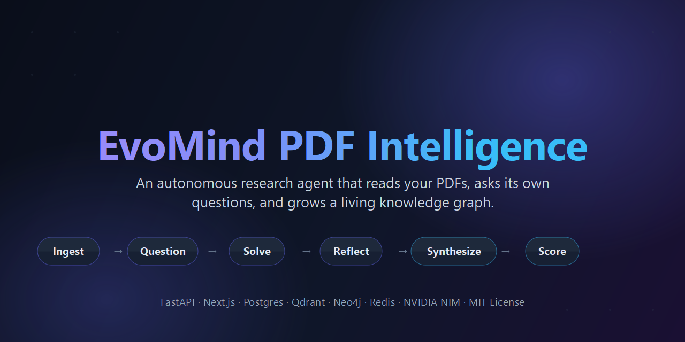
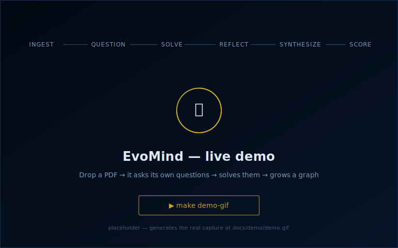

<div align="center">



# 🧠 EvoMind PDF Intelligence

### An autonomous research agent that reads your PDFs, asks its own questions, and grows a living knowledge graph.

[](https://github.com/harshd5382-droid/evomind-pdf-intelligence/actions/workflows/ci.yml)
[](LICENSE)
[](https://www.python.org/)
[](https://nextjs.org/)
[](https://react.dev/)
[](https://www.docker.com/)
[](CONTRIBUTING.md)
[](../../issues?q=label%3A%22good+first+issue%22)

<br/>

<!-- DEMO:START -->
<a href="docs/demo/README.md">
  
</a>
<!-- DEMO:END -->

<sub>▶ <b>Live demo</b> — drop a PDF, watch it question, solve, and graph itself. Generate the real capture with <code>make demo-gif</code> (<a href="docs/demo/README.md">how</a>).</sub>

</div>

---

> **TL;DR** — Drop a PDF in. EvoMind parses it, generates its own research questions across 9
> categories, answers them with grounded evidence + citations, reflects on each answer to spawn
> deeper questions, synthesizes insights across your whole library, proposes testable hypotheses,
> hunts for contradictions, and tracks an evolving "intelligence score" — all on autopilot.

EvoMind is an open-source platform for turning a pile of PDFs into an active, self-expanding body
of knowledge. **This is not a PDF chatbot.** It runs a **continuous research loop** that keeps
learning while you sleep.

```
   ┌──────────┐   ┌──────────┐   ┌────────┐   ┌─────────┐   ┌────────────┐   ┌───────┐
   │  INGEST  │──▶│ QUESTION │──▶│ SOLVE  │──▶│ REFLECT │──▶│ SYNTHESIZE │──▶│ SCORE │──┐
   └──────────┘   └──────────┘   └────────┘   └─────────┘   └────────────┘   └───────┘  │
        ▲                                                                                │
        └────────────────────────────  repeat forever  ◀───────────────────────────────┘
```

---

## 📸 What you get

| View | What it shows |
|------|---------------|
| **Dashboard** | Live intelligence score with trend, document table, ingest-queue status, LLM token spend |
| **Research Feed** | Real-time SSE stream — every question, answer, insight, and contradiction as it happens |
| **Mind** | The agent's self-model: first-person narrative, current beliefs, known unknowns, and what it's curious about |
| **Knowledge Graph** | Force-directed graph of papers ↔ concepts ↔ insights ↔ hypotheses |
| **Ask EvoMind** | Grounded chat over your corpus, with inline citations and confidence |
| **Question Tree** | The recursive question hierarchy the agent generated for itself |

> 📷 **Screenshots wanted!** This is a visual product and the README doesn't yet show it off.
> Capturing the six views above is
> [issue #9](https://github.com/harshd5382-droid/evomind-pdf-intelligence/issues/9) — a great
> first contribution. Drop the PNGs in `docs/screenshots/` and link them here.

---

## ✨ Key Features

- **🤖 Autonomous research loop** — an in-process autopilot continuously seeds, solves, reflects,
  synthesizes, and scores. Your only job is to add PDFs.
- **❓ 9 question categories** — every document is interrogated from nine angles:
  `understanding`, `deep_logic`, `missing_data`, `contradiction`, `math`, `application`,
  `research`, `meta`, and `improvement`.
- **🔍 Grounded answers with citations** — hybrid retrieval fuses **Qdrant** dense-vector search
  with **BM25** lexical search via Reciprocal Rank Fusion, so answers cite real passages and report
  a confidence score. No evidence? The answer is marked _unresolved_ instead of hallucinated.
- **🧩 Recursive curiosity** — the learner reflects on each answer, extracts concepts, and spawns
  follow-up child questions up to a configurable recursion depth.
- **🌐 Cross-document synthesis** — unifies insights across your entire corpus, generates testable
  **hypotheses**, and detects **contradictions** between documents.
- **🧠 Persistent memory** — episodic / semantic / long-term memory lets the agent recall prior
  conclusions across the whole library, not just the current PDF.
- **📈 Evolving intelligence score** — a composite metric that rewards insights, hypotheses, and
  resolved questions, snapshotted over time for trend analysis.
- **📡 Real-time research feed** — a Server-Sent Events stream surfaces every cycle event live in
  the UI.
- **📥 Drop-folder auto-ingest** — point it at a folder; new PDFs are picked up, ingested, and
  reasoned over automatically (idempotent, dedup by content hash).
- **🔌 Multi-provider LLM routing** — NVIDIA NIM (default, free tier), Anthropic, OpenAI, Gemini,
  or local **Ollama** — switch with one env var. Embeddings via NVIDIA or fully offline
  sentence-transformers.

---

## 🏗️ Architecture

A TypeScript/React frontend talks to a FastAPI backend, which orchestrates four specialized data
stores and a pluggable LLM layer.

```
                       ┌──────────────────────────────┐
                       │      Next.js 15 / React 19    │
                       │  Dashboard · Feed · Questions  │
                       │  Graph · Memory · Reports      │
                       └──────────────┬───────────────┘
                                      │  REST + SSE
                       ┌──────────────▼───────────────┐
                       │        FastAPI (Python)       │
                       │ ingestion · questioner ·      │
                       │ solver · learner · synthesis  │
                       │ orchestrator · scorer · memory │
                       └──┬─────┬─────┬─────┬─────┬────┘
                          │     │     │     │     │
                    Postgres  Redis  Qdrant  Neo4j  Celery+Beat
                    (records) (queue (vector (graph) (workers,
                               +SSE)  store)         autopilot)
```

### Backend modules (`apps/api/app/modules/`)

| Module | Responsibility |
|--------|----------------|
| `orchestrator.py` | Drives one full research cycle end-to-end and publishes live events |
| `questioner/` | Generates the 9 categories of questions per document (dedupes near-duplicates) |
| `solver/` | Hybrid retrieval + grounded answering with confidence & citations |
| `learner/` | Reflection, concept extraction, and recursive follow-up questions |
| `knowledge/` | Cross-document insights, hypotheses, and contradiction detection |
| `intelligence/` | Composite intelligence score + history |
| `memory/` | Persistent episodic / semantic memory across the corpus |

### Data stores

| Store | Role |
|-------|------|
| **PostgreSQL** | Documents, chunks, questions, answers, insights, hypotheses, contradictions, jobs, metrics |
| **Qdrant** | Dense embeddings for semantic search (fused with BM25) |
| **Neo4j** | Knowledge graph — Paper / Concept / Insight / Hypothesis nodes |
| **Redis** | Celery broker/backend + SSE pub/sub |

> 💡 **Zero-infra dev mode:** the backend gracefully degrades to **SQLite**, in-memory Qdrant
> (`memory://`), and an in-process task queue — so you can hack on it with no Docker and no external
> databases. If Celery isn't running, uploads and cycles fall back to in-process execution.

---

## 🚀 Quickstart

### Option A — Full stack with Docker (recommended)

```bash
git clone <your-fork-url> evomind && cd evomind
cp .env.example .env          # then add your LLM API key (see Configuration)
docker compose up --build
```

| Service | URL |
|---------|-----|
| 🖥️ Web UI | http://localhost:3000 |
| 📚 API + Swagger docs | http://localhost:8000/docs |
| 🕸️ Neo4j Browser | http://localhost:7474 (`neo4j` / `evomind123`) |
| 📦 Qdrant Dashboard | http://localhost:6333/dashboard |

The Docker stack runs `api`, `web`, `worker` (Celery), `beat` (scheduler), plus `postgres`,
`redis`, `qdrant`, and `neo4j`.

### Option B — Run apps individually

**Frontend** (`apps/web`):
```bash
cd apps/web
npm install
npm run dev        # http://localhost:3000
```

**Backend** (`apps/api`):
```bash
cd apps/api
python -m venv .venv && .venv\Scripts\activate     # macOS/Linux: source .venv/bin/activate
pip install -r requirements.txt                    # minimal; requirements-full.txt for all stores
cp ../../.env.example .env
uvicorn app.main:app --reload --port 8000

# (optional) workers
celery -A app.workers.celery_app.celery worker --loglevel=info
celery -A app.workers.celery_app.celery beat   --loglevel=info
```

### Your first PDF

1. Get a **free** NVIDIA NIM API key at [build.nvidia.com](https://build.nvidia.com/settings/api-keys)
   and set `NVIDIA_API_KEY` in `.env`.
2. Either **upload** a PDF in the web UI, or **drop it** into `data/dropbox/` — the folder watcher
   ingests it automatically.
3. Open the **Feed** page and watch EvoMind generate questions, solve them, and synthesize insights
   in real time. The **Graph** page shows the knowledge graph filling in.

---

## ⚙️ Configuration

All configuration lives in `.env` (copy from [`.env.example`](.env.example)). The variables you'll
most likely touch:

| Variable | Default | What it does |
|----------|---------|--------------|
| `PRIMARY_PROVIDER` | `nvidia` | LLM provider: `nvidia` \| `anthropic` \| `openai` \| `gemini` \| `ollama` |
| `NVIDIA_API_KEY` | _(empty)_ | Required when using NVIDIA NIM (free at build.nvidia.com) |
| `EMBEDDING_PROVIDER` | `nvidia` | `nvidia` \| `local` (offline sentence-transformers) \| `openai` |
| `QUESTIONS_PER_DOC` | `10` | Root questions generated per document |
| `RECURSION_DEPTH` | `2` | How deep follow-up questions go |
| `CONFIDENCE_THRESHOLD` | `0.55` | Below this, an answer is marked `unresolved` instead of `answered` |
| `INGEST_WORKERS` | `2` | Parallel PDF ingest threads (keep at 2 for NVIDIA free tier) |
| `AUTOPILOT_ENABLED` | `true` | Run the continuous research loop automatically |
| `AUTOPILOT_SOLVE_BATCH` | `3` | Questions drained per solve tick (each costs ~2 LLM calls) |

See [`.env.example`](.env.example) for the full annotated list (autopilot intervals, parser fallback
chain, infra DSNs, and more).

> ⚠️ `AUTONOMY_LEVEL` and `CREATIVITY` are accepted and surfaced in the Settings UI, but are **not
> yet read by any code path** — they're reserved. Tracking issue: wiring `CREATIVITY` to the
> questioner/learner sampling temperature. Don't expect them to change behavior today.

---

## 🗂️ Project Structure

```
evomind/
├── apps/
│   ├── api/                  # FastAPI backend (Python 3.11)
│   │   └── app/
│   │       ├── core/         # Settings + logging
│   │       ├── db/           # Postgres, Qdrant, Neo4j, Redis clients
│   │       ├── llm/          # Provider abstraction, router, prompts
│   │       ├── ingestion/    # PDF parse → chunk → embed pipeline
│   │       ├── modules/      # questioner, solver, learner, knowledge, intelligence, memory
│   │       ├── workers/      # Celery tasks + in-process fallback queue
│   │       └── api/          # REST routes + Pydantic schemas
│   └── web/                  # Next.js 15 / React 19 frontend
│       └── app/              # dashboard, feed, questions, graph, memory, reports, settings
├── docs/screenshots/         # README images (add yours here)
├── docker-compose.yml        # Full stack: api, web, worker, beat, postgres, redis, qdrant, neo4j
└── .env.example              # Annotated configuration template
```

---

## 🤝 Contributing

Contributions are very welcome — this project is built to grow with the community! 🎉

- Read **[CONTRIBUTING.md](CONTRIBUTING.md)** for dev setup, coding patterns, and the PR checklist.
- Browse **[good first issues](../../issues?q=label%3A%22good+first+issue%22)** to find an easy start.
- Be kind — we follow the **[Code of Conduct](CODE_OF_CONDUCT.md)**.
- Found a security issue? See **[SECURITY.md](SECURITY.md)** (please don't open a public issue).

**Great first contributions:** a new question category, an additional PDF parser, another LLM
provider, UI polish, tests, or docs. Adding a provider? Implement `LLMProvider.complete(...)` in
`apps/api/app/llm/providers/` and register it in `llm/router.py`.

---

## 📌 Project Status & Scope

EvoMind is a **strong, working foundation** — not a turnkey enterprise platform. Honest about what's
in the box:

**Works end-to-end today:** PDF upload → parse → chunk → embed → hybrid search · autonomous question
generation and grounded solving with confidence · depth-bounded self-learning loop · intelligence
score + history · live SSE feed · knowledge graph · autopilot + drop-folder ingest.

**Intentionally minimal (great contribution targets):** auth / multi-tenancy is stubbed (open API —
add JWT/OAuth as needed); the equation reasoner is sympy parsing + variable extraction; "teach me",
flashcards, and voice briefings are not yet implemented.

**⚠️ Not yet safe to expose on a network.** `AUTH_ENABLED` defaults to `false` and `docker compose`
publishes port 8000 on all interfaces. Run it on `localhost`, or set `AUTH_ENABLED=true` +
`API_KEYS=...` and bind to `127.0.0.1` first. See [SECURITY.md](SECURITY.md).

See the **[Roadmap](ROADMAP.md)** for what's planned, what's a non-goal, and where to help.

---

## 🧰 Tech Stack

**Frontend:** Next.js 15 · React 19 · TypeScript · Tailwind CSS · Recharts · react-force-graph-2d
**Backend:** FastAPI · SQLAlchemy 2 · Pydantic v2 · Celery · Loguru · tenacity
**AI/ML:** NVIDIA NIM · Anthropic · OpenAI · Gemini · Ollama · sentence-transformers · rank-bm25
**Data:** PostgreSQL · Qdrant · Neo4j · Redis
**Infra:** Docker · docker-compose

---

## 📄 License

Released under the [MIT License](LICENSE). Free to use, modify, and distribute — contributions back
are appreciated. ❤️

---

<div align="center">

**If EvoMind helps your research, please ⭐ the repo — it helps others find it!**

</div>
